# PowerShell IT Support Automation Lab

PowerShell | Active Directory | Windows Server | Hyper-V | CSV | HTML Reporting

## Overview

This project demonstrates the use of PowerShell to automate common IT support and Active Directory administrative tasks in a Windows Server lab environment.

The automation workflows inventory the Active Directory environment, create multiple user accounts from a CSV file, assign departmental security groups, reset passwords, offboard users, generate audit logs, and produce an HTML summary report.

The lab extends the previously created [Active Directory Home Lab](https://github.com/cmcabrera-tech/active-directory-home-lab) by adding repeatable and auditable administrative automation.

## Objectives

- Automate Active Directory inventory collection.
- Create multiple users from structured CSV data.
- Place users in the appropriate organizational units.
- Assign departmental security groups automatically.
- Validate duplicate accounts, OUs, and groups before provisioning.
- Perform secure password-reset operations.
- Require password changes at the next sign-in.
- Automate employee offboarding.
- Remove departmental group memberships.
- Disable and relocate offboarded accounts.
- Generate CSV audit logs for administrative actions.
- Produce an HTML management summary.
- Implement error handling and rollback protection.

## Lab Architecture

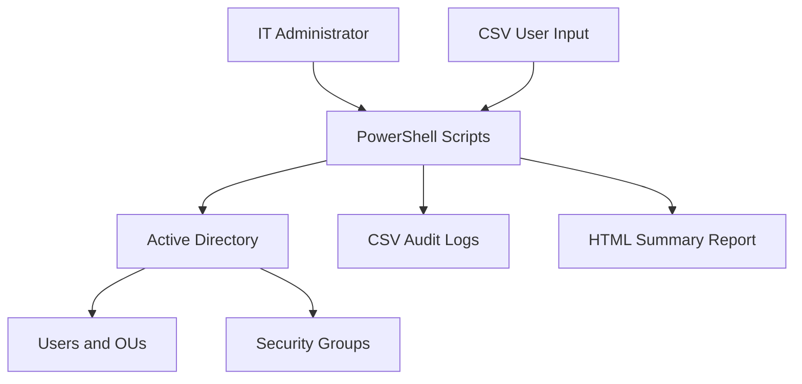

## Lab Environment

| Component | Configuration |
|---|---|
| Hypervisor | Microsoft Hyper-V |
| Server | Windows Server 2022 |
| Domain controller | DC01 |
| Domain | cabreralab.test |
| Directory service | Active Directory Domain Services |
| Automation platform | Windows PowerShell |
| Input format | CSV |
| Audit format | CSV |
| Management report | HTML |
| PowerShell module | ActiveDirectory |

## Automation Components

| Script | Purpose |
|---|---|
| `Get-ADInventory.ps1` | Inventories Active Directory users, groups, and organizational units |
| `New-ADUsersFromCSV.ps1` | Creates users from CSV data and assigns departmental groups |
| `Reset-ADUserPassword.ps1` | Resets passwords, unlocks accounts, and requires password changes |
| `Disable-ADUserOffboarding.ps1` | Disables accounts, removes groups, and moves users to the disabled OU |
| `New-AutomationLabReport.ps1` | Generates an HTML summary from Active Directory and audit data |

## Project Workflow

### 1. Active Directory inventory

The inventory script imports the Active Directory module and collects:

- User accounts
- Security and distribution groups
- Organizational units
- Domain information

The results are exported to separate CSV reports for later review.

### 2. Bulk user provisioning

A structured CSV file supplies the following properties:

- First and last name
- Username
- Department
- Job title
- Organizational unit
- Departmental security group

Before creating an account, the script validates that:

- The username does not already exist.
- The destination OU exists.
- The security group exists.
- The supplied password complies with domain policy.

The script then creates the user, assigns the departmental group, requires a password change at the next logon, and records the outcome.

### 3. Password reset automation

The password-reset workflow:

- Locates the requested account.
- Displays its enabled and lockout status.
- Accepts a temporary password securely.
- Resets the password.
- Unlocks the account when necessary.
- Requires a password change at the next sign-in.
- Records the technician, username, action, and result.

### 4. User offboarding

The offboarding workflow:

- Displays the employee's account information.
- Requires explicit confirmation.
- Disables the account.
- Removes non-default security groups.
- Adds an offboarding description and date.
- Moves the account to the Disabled Accounts OU.
- Generates an audit record.

### 5. HTML reporting

The reporting script consolidates information from Active Directory, the automation scripts, and CSV audit logs into a browser-readable dashboard.

The report displays:

- Total, enabled, and disabled users
- Security group and OU counts
- Bulk provisioning results
- Password-reset activity
- Offboarding activity
- PowerShell script inventory

## Error Handling and Safety Controls

The scripts implement several administrative safeguards:

- `-ErrorAction Stop` for terminating errors.
- `try/catch` blocks for controlled exception handling.
- Duplicate-account validation.
- OU and security-group validation.
- Secure password input using `Read-Host -AsSecureString`.
- Confirmation before offboarding.
- Rollback of partially created user accounts.
- CSV audit logging for traceability.
- No hard-coded passwords or production credentials.

## Evidence

### 1. PowerShell lab environment

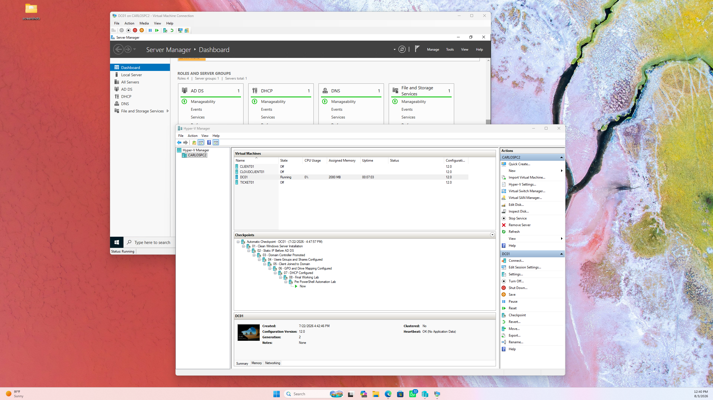

A Hyper-V checkpoint was created before making automation changes, providing a recovery point for the domain controller.

### 2. Active Directory environment verification

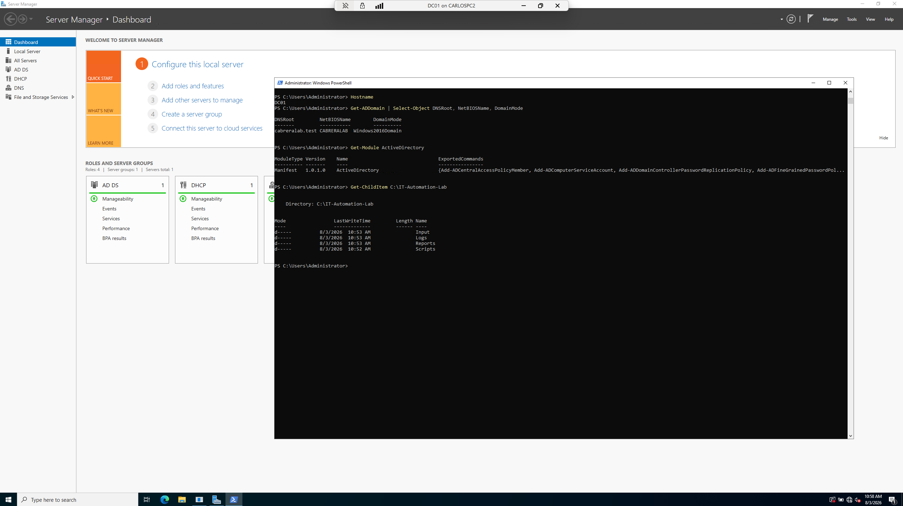

The domain, organizational-unit structure, and departmental security groups were verified before running automation scripts.

### 3. Active Directory inventory generation

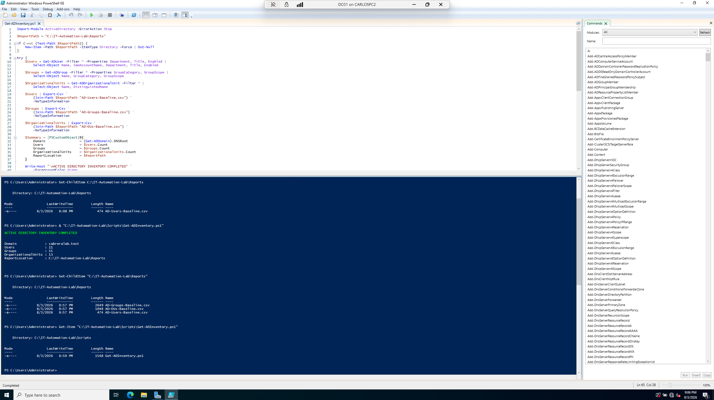

The inventory script collected domain users, groups, and organizational units and exported the results into CSV reports.

### 4. CSV provisioning input

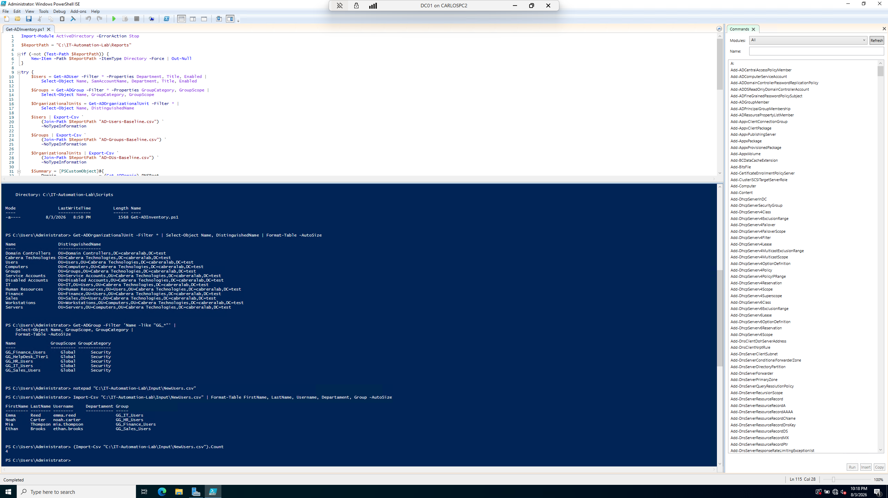

The structured input file contains the account, department, title, OU, and security-group information required for automated provisioning.

### 5. Bulk user creation

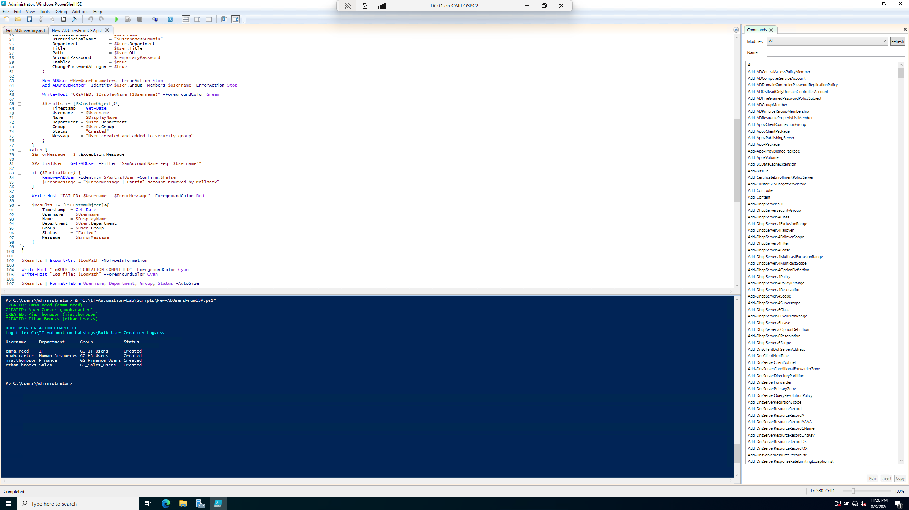

Four departmental accounts were successfully created after validation of the destination OUs, groups, and password policy.

### 6. User and group verification

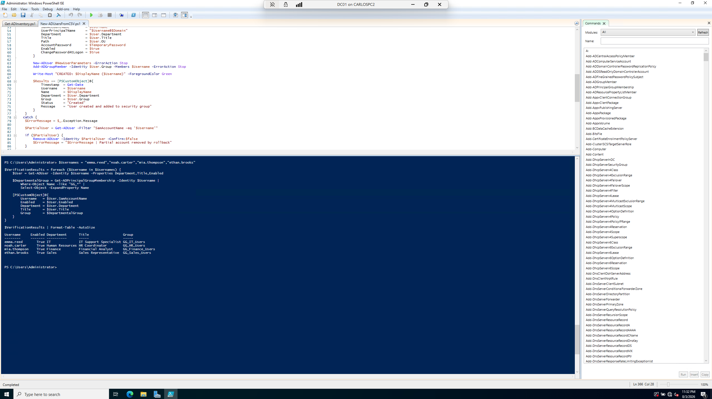

The newly created accounts were verified with their departmental attributes and Active Directory security-group memberships.

### 7. Password-reset automation

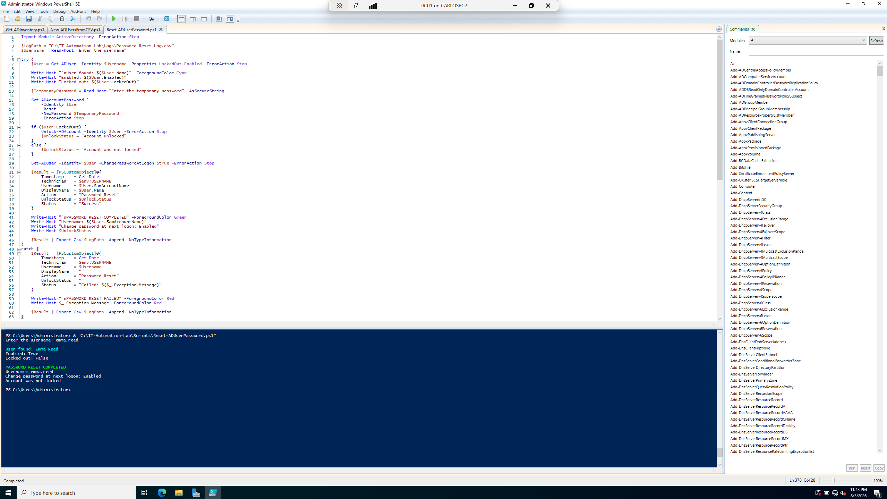

The password-reset script completed successfully and configured the user to change the temporary password at the next logon.

### 8. Password-reset audit record

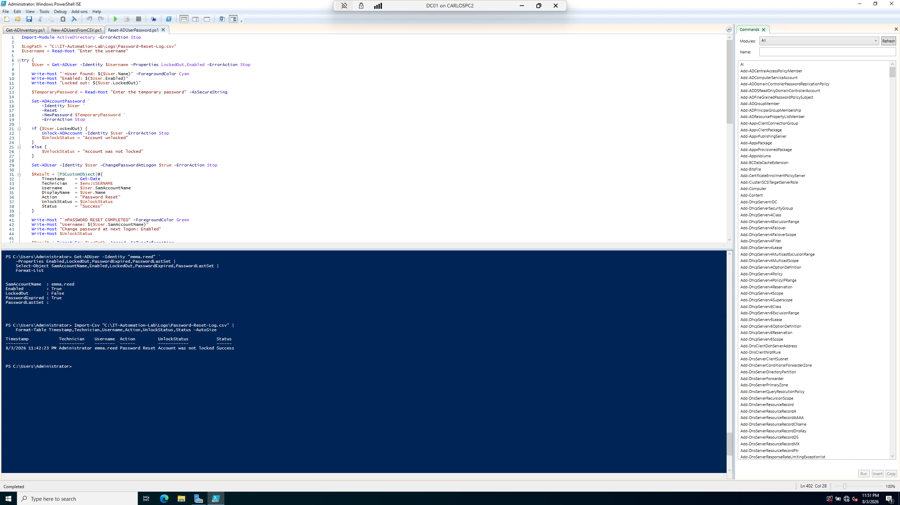

The account state and generated CSV audit record were reviewed to confirm the password-reset operation.

### 9. User offboarding verification

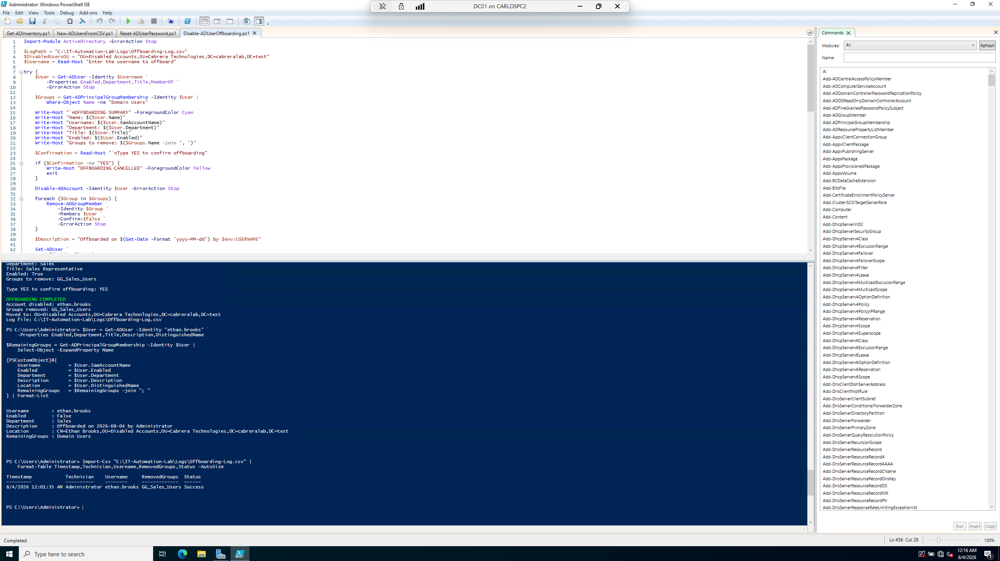

The offboarded account was disabled, removed from its departmental security group, moved to the Disabled Accounts OU, and recorded in the audit log.

### 10. HTML automation summary

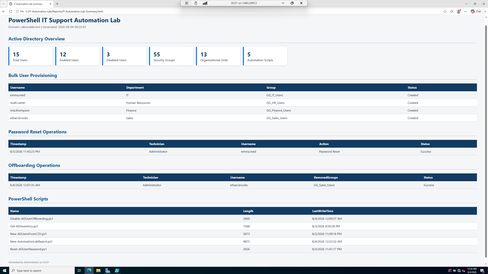

The final HTML dashboard summarizes Active Directory objects, provisioning activity, password resets, offboarding actions, and available automation scripts.

Additional chronological evidence is available in the [`screenshots`](screenshots/) directory.

## Results

The completed automation produced:

- 3 Active Directory inventory reports.
- 4 successfully provisioned departmental users.
- Validated departmental group memberships.
- A successful password-reset workflow.
- A successful employee-offboarding workflow.
- 3 CSV audit logs.
- A consolidated HTML summary report.
- 5 reusable PowerShell scripts.

## Skills Demonstrated

- PowerShell scripting
- Active Directory administration
- User lifecycle management
- Bulk account provisioning
- Organizational-unit management
- Security-group administration
- Password-reset support
- Employee offboarding
- CSV data processing
- HTML report generation
- Error handling and rollback
- Audit logging and documentation
- Hyper-V lab management

## Security Notice

This repository represents a controlled lab environment. The names and accounts used are fictional. Passwords, private credentials, and production information are not included.

## Author

**Carlos Cabrera**

IT Support | CompTIA A+ | Active Directory | Windows | Networking | PowerShell
